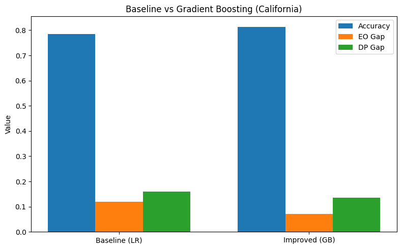
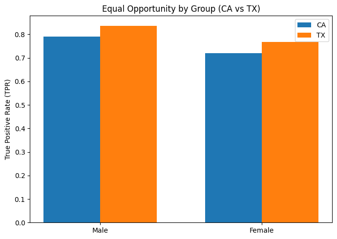

# Bias and Fairness Analysis in Income Prediction

> **Can a high-accuracy model still be unfair?**  
> This project shows yes — and demonstrates how to detect, measure, and reduce that unfairness.

---

## Key Results at a Glance

| | Logistic Regression (CA) | Gradient Boosting (CA) | Gradient Boosting (TX) |
|---|---|---|---|
| **Accuracy** | 0.79 | 0.81 | 0.79 |
| **Equal Opportunity Gap** | 0.12 | lower | slightly higher |
| **Demographic Parity Gap** | 0.16 | lower | 0.19 ↑ |
| **Post-mitigation DP Gap** | ~0.11 | — | — |

**Three headline findings:**
- A baseline Logistic Regression with 79% accuracy still shows a **16% demographic parity gap** by sex
- Switching to Gradient Boosting improves accuracy **and** reduces bias — but does not eliminate it
- Cross-state deployment (CA → TX) **increases the DP gap to 19%** even though accuracy stays stable — fairness does not transfer automatically

---

## Visualizations

### Fairness gap: baseline vs post-mitigation

## Baseline vs Gradient Boosting



## Equal Opportunity by Group (CA vs TX)


---

## Why This Matters

ML systems are increasingly used in high-stakes domains — lending, hiring, income estimation. A model optimised for accuracy alone can systematically disadvantage demographic groups while appearing to perform well on standard benchmarks. This project studies that gap concretely:

- How large is the disparity in a standard baseline?
- Does a stronger model automatically reduce it?
- Do fairness properties hold when the model is deployed on new population data?

---

## Dataset

- **Source:** [Folktables](https://github.com/zykls/folktables) — U.S. Census ACS Income (2018)
- **Task:** Binary classification — income > $50K
- **Sensitive attribute:** Sex (Male / Female)
- **Training state:** California (CA) — ~195K records
- **Deployment state:** Texas (TX) — distribution shift evaluation

Folktables is derived from real U.S. Census data and is a standard benchmark in fairness research.

---

## Experiments

### 1. Baseline model and fairness audit

A Logistic Regression model is trained on California data and evaluated on both predictive performance and fairness metrics.

**Metrics used:**
- **Equal Opportunity (EO):** True Positive Rate gap between male and female groups
- **Demographic Parity (DP):** Difference in positive prediction rates between groups

**Result:** The baseline achieves 79% accuracy but shows a 12% EO gap and 16% DP gap — significant gender-based disparity despite reasonable performance.

---

### 2. Does a better model reduce bias?

A Gradient Boosting classifier is trained on the same data and compared to the baseline.

**Result:** Accuracy increases to 81% and fairness gaps decrease, but bias is not eliminated. Improving model capacity can reduce underfitting-driven bias, but does not guarantee fairness.

---

### 3. Post-processing fairness mitigation

Group-specific decision thresholds are applied — the threshold for the disadvantaged group (Female) is lowered to reduce the Equal Opportunity gap.

**Result:** EO gap reduces significantly with less than 2% accuracy loss. This illustrates the classic accuracy–fairness trade-off and shows that fairness requires explicit intervention, not just better modelling.

---

### 4. Cross-state deployment evaluation

The CA-trained Gradient Boosting model is evaluated on Texas data **without retraining**, simulating real deployment under distribution shift.

**Result:** Accuracy remains at ~0.79, but the Demographic Parity gap increases to 0.19 — higher than the in-distribution result. Fairness properties observed during training **do not generalise** to new populations.

---

## Technical Stack

```
Python 3.x
scikit-learn       — Logistic Regression, Gradient Boosting, preprocessing
folktables         — ACS Census data loader
pandas / numpy     — data manipulation
matplotlib         — visualisation
```

Install dependencies:

```bash
pip install -r requirements.txt
```

---

## Reproducing Results

```bash
# Clone the repo
git clone https://github.com/BHAVYASRIBUDDAI/Bias-and-Fairness-Analysis-in-Income-Prediction.git
cd Bias-and-Fairness-Analysis-in-Income-Prediction

# Install dependencies
pip install -r requirements.txt

# Run notebooks in order
jupyter notebook notebooks/
```

Notebooks are numbered and self-contained. All results can be reproduced on CPU — no GPU required.

---

## Limitations and Future Work

- Only post-processing mitigation (threshold adjustment) was explored. In-processing methods (adversarial debiasing, reweighting) are left for future work.
- Analysis focuses on sex as the sensitive attribute. Intersectional analysis across sex × race is a natural extension.
- Results are based on tabular census data and may not generalise to other domains or fairness definitions.

---

## Key Takeaways

1. **High accuracy ≠ fair model.** The baseline is 79% accurate and still shows a 16% DP gap.
2. **Stronger models can reduce bias but not reliably.** Gradient Boosting helps — it is not a fix.
3. **Fairness does not transfer across populations.** CA fairness properties degrade on TX data even when accuracy holds.
4. **Mitigation requires explicit design choices.** Bias does not disappear on its own.

---

## License

MIT — see [LICENSE](LICENSE)
